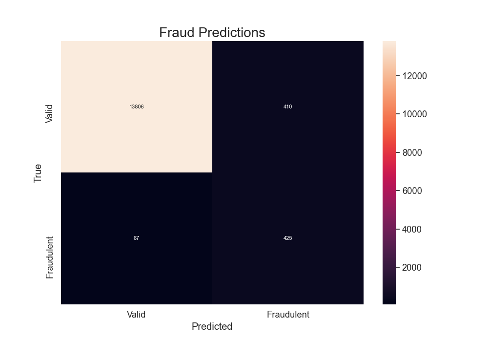

# Credit Card Fraud Predictions
### Credit card fraud detection using an autoencoder

This repo contains my attempt at predicting anomalous data in the form of fraudulent credit card transactions.

I trained an autoencoder on a training set consisting of only 'normal' patterns (i.e. non-fraudulent transactions) 
and used the reconstruction error (MSE) to classify patterns as normal or anomalous.

If the reconstruction error of a pattern lies more than 1 standard deviation from the mean reconstruction error 
(of the training set), a pattern is considered anomalous. 

This method results in the following metrics on the test set:

|Accuracy | Precision | Recall |  
|---------|-----------|--------|  
| 96.75%  |   50.89%  | 86.38% |  

---
#### How to run it:
1. Download the dataset from Kaggle [here](https://www.kaggle.com/mlg-ulb/creditcardfraud), and extract the 
`creditcard.csv` file into a folder named `data` in the root of the repository.

2. Install the requirements by running  
  `pip install -r requirements.txt`

3. Then execute the `anomaly_detection` module by running  
  `python -m anomaly_detection`
